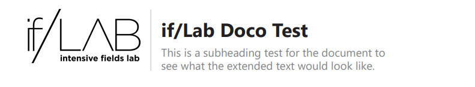

# Super Mario Reinforcement Learning
Learning into to reinforcement learning with python and OpenAI Gym 

## Reference 
https://www.youtube.com/watch?v=2eeYqJ0uBKE

# Testing Docs in Git

    

**Documentation Link:**  
https://github.com/davidptsmith/DataScienceProjects/blob/main/01%20Super%20Mario%20RL/_docs/super_mario_rl_docs.pdf
